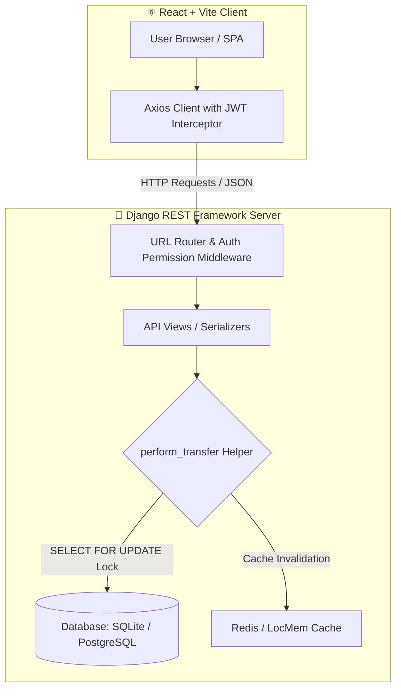

<div align="center">

# 🏦 SecureBank — Full-Stack Banking Application

<p align="center">
  <strong>A production-grade, secure full-stack banking platform built with Django REST Framework and React + Vite.</strong>
</p>

[](https://www.python.org/)
[](https://www.djangoproject.com/)
[](https://react.dev/)
[](https://vitejs.dev/)
[](https://jwt.io/)
[](#-testing--quality-assurance)

<br/>

[✨ Features](#-key-features) •
[🏛️ Architecture](#-system-architecture) •
[⚡ Quick Start](#-quick-start) •
[🔒 Concurrency & Logic Fixes](#-concurrency--logic-fixes) •
[🔌 API Documentation](#-api-documentation) •
[🌐 Live Server Deployment](#-live-server-deployment)

</div>

---

## ✨ Key Features

| Feature | Description |
| :--- | :--- |
| 🔐 **Secure JWT Authentication** | Dual-token mechanism (short-lived access + 7-day refresh tokens) with auto-refresh interceptors. |
| 🎁 **Instant Account Creation** | Generates a unique 12-digit account number and short Web ID with a ₹1,000 welcome bonus. |
| 💸 **Bank Transfer** | Send money instantly using the recipient's 12-digit account number. |
| ⚡ **Web ID Pay (UPI-Style)** | Send money using memorable short IDs (e.g. `@john1abc`) with live user validation. |
| 📊 **Real-time Balance Dashboard** | Live total balance overview, formatted numbers in Indian numbering system (`₹1,00,000`), quick action controls. |
| 📜 **Full Audit History** | Filterable transaction logs with status badges (`Completed`, `Failed`) and instant reference IDs. |
| 🛡️ **Race-Condition Safety** | Row-level locking (`SELECT FOR UPDATE`) prevents double-spending or negative balances under heavy concurrent loads. |

---

## 🏛️ System Architecture



---

## 🔒 Concurrency & Logic Fixes

This codebase includes critical production-grade fixes:

### 1. 🛡️ Concurrency Race-Condition Resolution (`SELECT FOR UPDATE`)
- **Problem**: Previously, two rapid concurrent transfer requests from the same user could both pass the `balance >= amount` check before either balance was updated, leading to **double spending** or **negative balance (overdraft)**.
- **Solution**: Implemented `select_for_update()` inside an `atomic()` block in [`backend/banking/utils.py`](file:///c:/Users/cibil/OneDrive/文档/project%20using%20python/Banking%20Management%20System/bank/backend/banking/utils.py).
- **Deadlock Avoidance**: Accounts are locked in ascending order of primary key (`sorted([sender_id, receiver_id])`), guaranteeing deadlock-free concurrency.

```python
# Deadlock-free row-level locking pattern
lock_ids = sorted([sender_account.pk, receiver_account.pk])
locked_accounts = BankAccount.objects.select_for_update().filter(pk__in=lock_ids).in_bulk()
```

### 2. 🚨 Password Validation Exception Handler (`400 Bad Request` vs `500 Crash`)
- **Problem**: Django's built-in `validate_password` raises `django.core.exceptions.ValidationError`. Unhandled in DRF serializers, this caused `500 Internal Server Error` crashes during user registration when weak passwords were submitted.
- **Solution**: Caught `DjangoValidationError` in [`serializers.py`](file:///c:/Users/cibil/OneDrive/文档/project%20using%20python/Banking%20Management%20System/bank/backend/banking/serializers.py) and converted it into a clean `serializers.ValidationError` returning standard `400 Bad Request`.

---

## 🛠️ Tech Stack

| Layer | Technology | Function |
| :--- | :--- | :--- |
| **Frontend** | React 18 + Vite | Single Page Application with dynamic state |
| **Styling** | Vanilla Modern CSS & Glassmorphism | Custom design tokens, micro-animations, dark theme |
| **Icons & Toasts**| Lucide-React & React-Hot-Toast | Clean visual system & real-time notification alerts |
| **Backend** | Django 4.2 + DRF 3.14 | REST API server with JWT middleware |
| **Database** | SQLite (dev) / PostgreSQL (prod) | ACID-compliant relational storage |
| **Caching** | LocMemCache / Redis | Dashboard acceleration & session cache |

---

## ⚡ Quick Start

### Prerequisites
- **Python 3.10+**
- **Node.js 18+**
- **npm** or **yarn**

---

### Step 1: Backend Setup (Django)

```bash
# Navigate to backend
cd backend

# Create and activate virtual environment
python -m venv venv

# Windows:
venv\Scripts\activate
# Mac/Linux:
source venv/bin/activate

# Install dependencies
pip install -r requirements.txt

# Create .env from example (optional defaults supplied)
copy .env.example .env   # Windows
cp .env.example .env     # Mac/Linux

# Apply migrations
python manage.py makemigrations
python manage.py migrate

# (Optional) Create superuser for Django Admin
python manage.py createsuperuser

# Start development server
python manage.py runserver
```

> 🌐 Backend API running at: `http://localhost:8000/api/`  
> 🔑 Django Admin at: `http://localhost:8000/admin/`

---

### Step 2: Frontend Setup (React)

```bash
# Open a second terminal and navigate to frontend
cd frontend

# Install dependencies
npm install

# Start Vite dev server
npm run dev
```

> 💻 Frontend Web App running at: `http://localhost:5173/`

---

## 🧪 Testing & Quality Assurance

The backend includes a unit test suite covering 34 test cases across all critical financial and authentication logic.

```bash
# Run backend test suite
cd backend
python manage.py test banking --verbosity=2
```

### Test Coverage Highlights:
- ✅ **Signup & Login**: Password strength enforcement (`400` validation check), duplicate emails, bad credentials.
- ✅ **Transfers**: Negative amounts, zero amounts, insufficient funds, self-transfers, non-existent account numbers.
- ✅ **Concurrency**: Multi-threaded race condition tests asserting zero overdrafts under concurrent load.
- ✅ **Lookups & Dashboard**: Verification of Web ID lookup and dashboard balance payload accuracy.

---

## 🔌 API Documentation

Base Endpoint: `/api/`

| Method | Endpoint | Auth | Description |
| :--- | :--- | :---: | :--- |
| `POST` | `/api/signup/` | ❌ | Create new user account and receive JWT access/refresh tokens. |
| `POST` | `/api/login/` | ❌ | Authenticate email/password and receive JWT tokens. |
| `POST` | `/api/token/refresh/` | ❌ | Exchange refresh token for a new access token. |
| `POST` | `/api/create-account/` | ✅ | Open a bank account and receive ₹1,000 welcome bonus. |
| `GET` | `/api/dashboard/` | ✅ | Get user details, bank balance, and 5 recent transactions. |
| `POST` | `/api/transfer/bank/` | ✅ | Transfer money using recipient's 12-digit account number. |
| `POST` | `/api/transfer/webid/` | ✅ | Transfer money using recipient's Web ID (`@handle`). |
| `GET` | `/api/transactions/` | ✅ | Full transaction history with optional `?type=bank` or `?type=webid`. |
| `GET` | `/api/lookup/webid/<web_id>/` | ✅ | Pre-verify recipient name by Web ID before sending funds. |
| `GET` | `/api/lookup/account/<no>/` | ✅ | Pre-verify recipient name by account number. |

---

## 🌐 Live Server Deployment

### 1. Environment Configuration (`backend/.env`)
Set the following production variables in your server host (Render, Heroku, Railway, DigitalOcean):

```env
SECRET_KEY=your-secure-production-secret-key
DEBUG=False
ALLOWED_HOSTS=api.yourdomain.com,your-app.onrender.com
CORS_ALLOWED_ORIGINS=https://yourdomain.com,https://your-frontend.vercel.app
```

### 2. Static Files Collection
```bash
python manage.py collectstatic --noinput
```

### 3. Frontend Build (`frontend/.env`)
Create a `.env` file in `frontend/` for production API binding:

```env
VITE_API_URL=https://api.yourdomain.com/api
```

Build static bundle:
```bash
cd frontend
npm run build
```

---

## 📁 Repository Structure

```
bank/
├── backend/                      # Django REST API Backend
│   ├── banking/                  # Primary application module
│   │   ├── models.py             # User, BankAccount, Transaction schemas
│   │   ├── views.py              # API endpoint handlers
│   │   ├── utils.py              # Atomic transfer logic & caching
│   │   ├── serializers.py        # DRF data serialization & validation
│   │   ├── tests.py              # 34-case unit test suite
│   │   └── urls.py               # Banking API routes
│   ├── config/                   # Django settings & root router
│   ├── manage.py                 # Django CLI tool
│   ├── .env.example              # Sample environment configuration
│   └── requirements.txt          # Core dependencies
│
└── frontend/                     # React + Vite Frontend
    ├── src/
    │   ├── api/axios.js          # Configured Axios instance with JWT interceptor
    │   ├── context/AuthContext.jsx# React Context for login/user state
    │   ├── pages/                # Login, Signup, Dashboard, Transfer, History pages
    │   └── App.jsx               # Router & Toast notification container
    ├── package.json              # NPM dependencies
    └── vite.config.js            # Vite build configuration
```

---

## 📄 License & Credits

Developed with ❤️ for **SecureBank Application**. Open-source under the MIT License.
